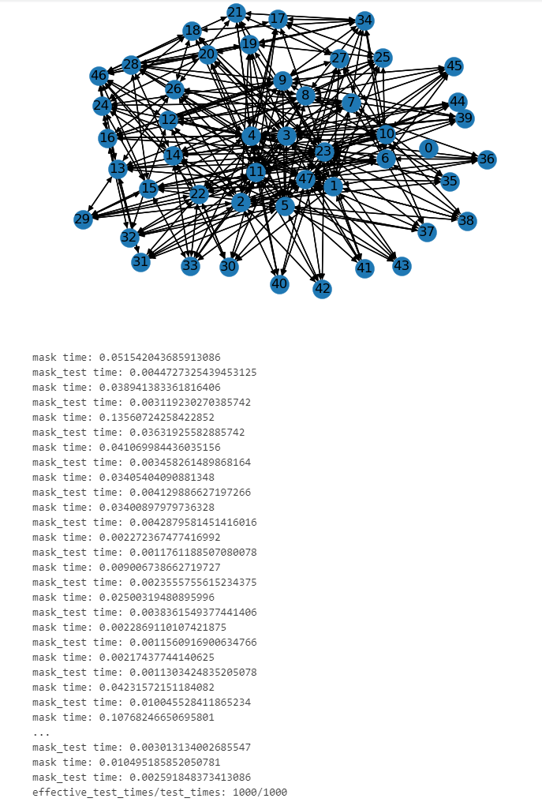

## Usage

You can use the following command, and the parameters are given

For graph classification task:

```python
python main.py --dataset ENZYMES
```

The `--dataset` argument should be one of [ENZYMES, PTC-MR, NCI1, NCI109, PROTEIN, DD, MUTAG, IMDB-B, IMDB-M, COLLAB, RDT-M5].

查看显卡占用 How to check the gpu usage of the server

```bash
nvidia-smi
```

查看当前后台任务，根据 string 搜索 How to check the background task，and search by string

```bash
ps -ef | grep "string"
```

如果 run.sh 报如下错误 If the run.sh report the following error

```bash
run.sh: 行 4: $'\r'：未找到命令
run.sh: 行 5: 未预期的符号“$'\r'”附近有语法错误
run.sh: 行 5: `for i in {1..15};
```

这是由于 windows 文件和 linux 文件换行符不同造成的，请使用 awk 命令转换格式 This is caused by the different line breaks of windows files and linux files, please use the awk command to convert the format

```bash
awk '{sub(/\r$/,"")};1' run.sh > run2.sh
mv run2.sh run.sh
```

查看日志总结 How to check the log summary

```bash
python summary_logs.py nohups/20230527* # summary the logs created in 20230527
```

```bash
python summary_logs.py nohup_logs/20230527172946/  # summary the logs in the folder
```

```bash
python summary_logs.py nohup_logs/20230527172946/ nohup_logs/20230526172946/  # summary the logs in the folders
```

## 两种遮盖实现 Two masking implementations

我们有两种遮盖实现，一种采用了将 dgl.graph 的 adj_matrix 稀疏矩阵转化为一般矩阵的，然后利用矩阵运算找邻居的方式，我们用mask表示，另一种采用了递归的方式找邻居，我们用 mask_right 表示（命名的来源是因为一个 mask_right 是我们最先实现的，用来作为测试基准判断 mask 的正确性） We implemented two masking methods, one is to convert the adj_matrix of dgl.graph into a general matrix, and then use matrix operations to find neighbors, we use mask to represent. The other is to use recursion to find neighbors, we use mask_right to represent (the name comes from the fact that mask_right is the first one we implemented to be used as a test benchmark to judge the correctness of mask)

对比 mask 和 mask_right | Contrast mask and mask_right:

| mask_method | CPU memory/cuda memory | time |
| :---------: | :----------------: | :--: |
|    mask     | 当图较大时，内存占用会非常大，我们在使用数据集 REDDIT-B 时，CPU memory 占用 60 G，cuda memory 占用 60 G </br> When the graph is large, the memory usage will be very large. When we use the REDDIT-B dataset, the CPU memory usage is 60 G, and the cuda memory usage is 60 G | 比 mask_right 的递归方式最多能快 10 倍 </br> Up to 10 times faster than the recursive method of mask_right |
| mask_right | 内存占用比 mask 小很多，使用 12G cuda memory 能运行多数数据集 </br> The memory usage is much smaller than mask, and most datasets can run with 12G cuda memory | 比 mask 的矩阵运算方式最多能慢 10 倍，但是使用了 python 的 functools.lru_cache 优化，部分情况下和 mask 的矩阵运算方式相当 </br> Up to 10 times slower than the matrix operation method of mask, but optimized with python's functools.lru_cache, in some cases it is equivalent to the matrix operation method of mask |

### 对比测试 Contrast test

测试代码位于 test/test.ipynb 中 The test code is in test/test.ipynb

测试结果 Test results:

